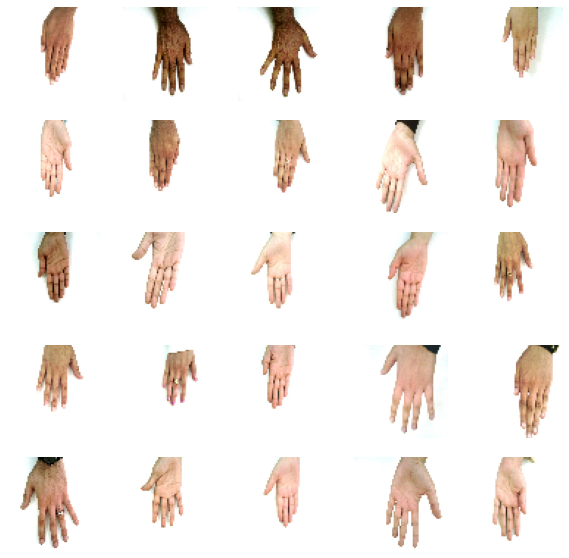

# Image Synthesis with DCGAN

### Description 

A generative adversarial network (GAN) learns the training data’s distribution pdataand allows us to generate new data from that distribution. It consists of two distinct models: a discriminator D(x) and a generator G(x) for input data x. In training, the two models play a zero-sum gam. 

D(x) is the scalar probability that the output of the generator is taken from the real training data. D(G(z))is the scalar probability that the output of the generator is from pz.The discriminator is maximizing the probability that it is correctly classifying the output as real or fake. The generator is maximizing the probability that the discriminator will incorrectly classify fake output as real. This is expressed as minimizing 1−D(G(z))). (Goodfellow et al. 2016)

A deep convolutional generative adversarial network (DCGAN) is an extension of the GAN using specific layers in each model. The generator consists of strided convolutional-transpose layers, batch normalization layers, and ReLU activations. The discriminator is composed of strided convolution layers, batch normalization layers, and LeakyReLU activations. 

The best results for this dataset uses a keras sequential model for the generator and discriminator. The generator starts with a fully connected layer with input equal to the noise dimension, which is sampled from a Gaussian probability distribution. The convolution and convolutional-transpose layers have a kernel of 5x5 and stride of 2x2. The discriminator loss uses one-sided label smoothing for the real input. Generator architecture is show below: 

*Figure obtained from Radford et al. (2017)*

### Dataset

Hands Dataset: 11076 images obtained from Mahmoud (2019) https://sites.google.com/view/11khands

Images are resized to 64x64x3, batched into batches of 128, and shuffled. Sample training data is shown below:

### Execution

Usage: `python DCGAN_local.py [-r <offset>] <training> <epochs>`

    Options:
    -r              restore training starting from offset+1 (optional)

    Args:
    offset:         where the last session ended (required with -r option)
    training:       training session number (int)
    epochs:         number of epochs to run for (int)
    

Usage: `python generate_img.py <training> <noise_dim> <num>`

    Args:
    training:       training session number to load model (int)
    noise_dim:      noise dimension that model uses (int)
    num:            number of examples to generate (int)
    
### Dependencies:

  - `tensorflow 2.x`
  - `keras`
  - `NumPy`
  - `matplotlib`
  - `imageio`
  - `iPython`
  - `CUDA` toolkit compatible with your GPU (optional)
  
### References

Amos, Brandon. Image Completion with Deep Learning in TensorFlow, 9 Aug. 2016, bamos.github.io/2016/08/09/deep-completion/.
“DCGAN Tutorial.” 

DCGAN Tutorial - PyTorch Tutorials 1.4.0 Documentation, pytorch.org/tutorials/beginner/dcgan_faces_tutorial.html.

“Deep Convolutional Generative Adversarial Network  :   TensorFlow Core.” TensorFlow, www.tensorflow.org/tutorials/generative/dcgan. 

Goodfellow, Ian J. et al. “Generative Adversarial Nets.” NIPS (2014).

Goodfellow, Ian J.. “NIPS 2016 Tutorial: Generative Adversarial Networks.” ArXiv abs/1701.00160 (2016): n. pag.

Mahmoud Afifi, "11K Hands: Gender recognition and biometric identification using a large dataset of hand images." Multimedia Tools and Applications, 2019.

Radford, Alec et al. “Unsupervised Representation Learning with Deep Convolutional Generative Adversarial Networks.” CoRR abs/1511.06434 (2016): n. pag.

Yeh, Raymond A. et al. “Semantic Image Inpainting with Deep Generative Models.” 2017 IEEE Conference on Computer Vision and Pattern Recognition (CVPR) (2016): 6882-6890.
